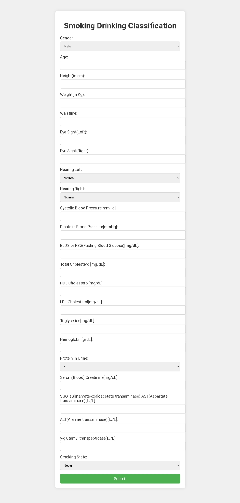
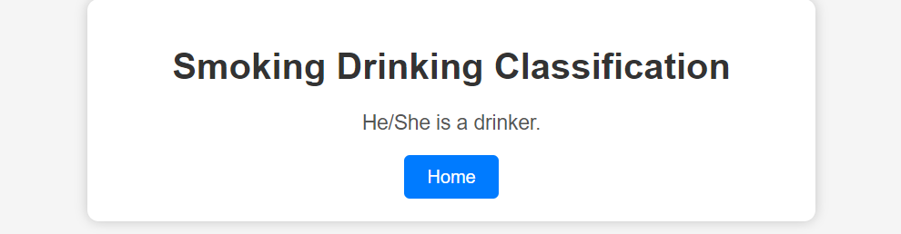
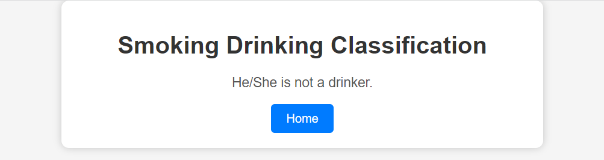

# Smoking and Drinking Classification Problem

This repository contains code and data for a classification problem to predict smoking and drinking habits based on health-related features. The dataset is stored in `dataset.csv`, which includes columns such as sex, age, height, weight, and various health indicators.

## Dataset

The dataset is stored in `dataset.csv` and contains the following columns:
- sex
- age
- height
- weight
- waistline
- sight_left
- sight_right
- hear_left
- hear_right
- SBP
- DBP
- BLDS
- tot_chole
- HDL_chole
- LDL_chole
- triglyceride
- hemoglobin
- urine_protein
- serum_creatinine
- SGOT_AST
- SGOT_ALT
- gamma_GTP
- SMK_type_cd
- DRK_YN

## Notebook

The data preprocessing, exploratory data analysis, and model training are performed in the Jupyter notebook `notebook.ipynb`. The notebook includes the following steps:
1. Importing necessary libraries.
2. Loading the dataset and performing data cleaning (removing duplicates and handling missing values).
3. Data preprocessing, including mapping categorical values to numerical values.
4. Exploratory data analysis (EDA) with visualizations.
5. Splitting the data into training and testing sets.
6. Standardizing the features.
7. Training machine learning models (logistic regression, random forest classifier, gradient boosting classifier).
8. Evaluating models and saving the best-performing model using pickle.

## Flask Web App

A Flask web app has been created to deploy the trained model for predictions. The Flask web app allows users to input health-related features and predicts smoking and drinking habits based on the trained model.

### Running the Flask Web App

To run the Flask web app, follow these steps:
1. Install the required libraries listed in `requirements.txt` using `pip install -r requirements.txt`.
2. Run the Flask app by executing `python app.py`.
3. Open the web app in your browser by navigating to `http://localhost:5000`.

### Web App Structure
- `app.py`: Contains the Flask application code, including routes for the homepage and prediction result pages.
- `templates/`:
  - `index.html`: Homepage where users can input their health-related features.
  - `true.html`: Page displayed when the prediction output is 1 (true).
  - `false.html`: Page displayed when the prediction output is 0 (false).

## Files in the Repository
- `dataset.csv`: Dataset containing the health-related features and target variable.
- `notebook.ipynb`: Jupyter notebook containing data preprocessing, EDA, and model training.
- `app.py`: Flask application for deploying the trained model.
- `templates/`: Directory containing HTML templates for the web app.
- `requirements.txt`: List of required libraries for running the Flask web app.

For any questions or suggestions, please feel free to contact me on LinkedIn.

## Webpage Glimpse:

